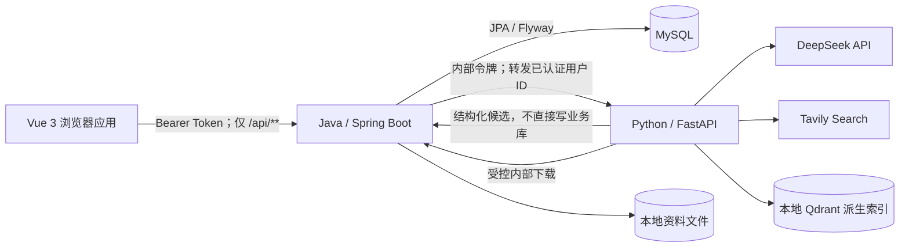

# StudyPilot 前端开发对接说明

> 面向对象：负责 Vue 3 前端设计与开发的工程师或 AI 编程助手
>
> 契约基线：阶段 9 首节交互式课程完成版本（2026-07-30）
>
> Java 地址：`http://localhost:8080`
>
> Python 地址：`http://localhost:8000`

本文是前端开发的主要上下文。文中的 Java `/api/**` 均已实现，可以直接联调。
阶段 8 Agent 门面、会话恢复和用户 AI Key 安全存储也已上线；Mock Adapter 现在只用于
自动化测试和显式离线演示。

`/internal/**` 永远不是浏览器接口。即使 Python 已经实现对应能力，前端也不能直接
调用它，更不能获得内部服务令牌。

---

## 1. 产品与系统边界

StudyPilot 是个人 Java + AI 交互式学习平台。课程学习是第一入口；计划、每日任务、
资料、知识问答和 Agent 调整共同辅助教学闭环。



职责边界：

- **Vue**：页面、表单、交互状态、操作预览、用户确认和来源展示。
- **Java**：身份、用户隔离、业务数据、事务、版本、幂等、授权和审计，是业务事实
  唯一来源。
- **Python**：模型调用、LangGraph 编排、RAG、联网搜索、资料解析和异步代码文本
  评价，不直接连接 MySQL。
- **模型**：只能输出候选或评价，不能绕过 Java 修改数据。

### 1.1 浏览器安全铁律

1. 浏览器只访问 Java 的 `/api/**`。
2. 禁止访问 Java 或 Python 的 `/internal/**`。
3. 禁止在前端源码、构建变量、LocalStorage、日志或错误提示中保存
   `X-Internal-Service-Token`、DeepSeek Key、Tavily Key 或数据库密码。
4. 当前 Bearer Token 暂存 `sessionStorage`，刷新页面后可恢复；退出或收到 401 时
   立即清除。不要使用 LocalStorage 做长期登录。
5. API Key 设置页只保留输入框的临时内存值，提交成功后立即清空。服务端只允许
   返回 `configured` 和脱敏尾号，绝不回传完整 Key。
6. 所有资源归属由 Java 从 Bearer Token 推导。前端公共请求不得提交 `ownerId`。

---

## 2. 前端工程建议

推荐技术栈：Vue 3、TypeScript、Vite、Pinia、Vue Router、Axios。

```text
web/src/
├── app/                    应用启动、路由、全局布局
├── modules/
│   ├── auth/               登录、注册、会话
│   ├── dashboard/          工作台
│   ├── learning/           目标、计划、任务
│   ├── materials/          导入、解析状态、来源
│   ├── agent/              计划对话、任务 Agent、知识问答、调整
│   ├── assessment/         测验、作答、掌握度
│   ├── course/             路线、课时、播放器、讲义、课内导师
│   └── settings/           学习设置、AI 设置、授权
├── services/
│   ├── http.ts             Axios 实例和拦截器
│   ├── current/            当前真实 Java API
│   └── planned/            Agent 门面 Adapter（默认真实 HTTP）
├── stores/                 Pinia 状态
├── components/             通用组件
└── types/                  契约类型和枚举
```

约束：

- 页面和组件不能直接调用 Axios 或拼接 URL，只能调用 `services`。
- `planned` 下定义统一接口，并提供 `HttpAgentGateway` 和测试用
  `MockAgentGateway`；默认运行实现必须是 HTTP，切换不能影响页面。
- 服务端数据保留原始英文枚举，中文文案只在展示层映射。
- 日期使用 `YYYY-MM-DD`，时间使用 `HH:mm:ss`，时间戳使用 ISO 8601。
- 金额、分数和预计费用不要使用真假判断隐藏 `0`；应显式判断 `null`。

### 2.1 页面与路由建议

| 路由 | 页面 | 当前状态 |
|---|---|---|
| `/login`、`/register` | 登录与注册 | ✅ 可联调 |
| `/` | 仪表盘 | ✅ 可联调 |
| `/courses` | Java + AI 课程中心 | ✅ 可联调 |
| `/courses/:slug` | 九模块学习路线 | ✅ 可联调 |
| `/lessons/:lessonId` | 视频、讲义、代码、导师和练习 | ✅ 可联调 |
| `/goals` | 学习目标 | ✅ 可联调 |
| `/plans`、`/plans/:id` | 计划、版本和任务 | ✅ 可联调 |
| `/today` | 今日任务与打卡 | ✅ 可联调 |
| `/materials`、`/materials/:id` | 资料导入与处理状态 | ✅ 可联调 |
| `/quizzes/:id` | 测验作答 | ✅ 已知测验 ID 后可联调 |
| `/attempts/:id` | 异步评分和自评 | ✅ 可联调 |
| `/mastery` | 掌握度 | ✅ 可联调 |
| `/notifications` | 通知 | ✅ 可联调 |
| `/activity` | Agent 执行和审计 | ✅ 可联调 |
| `/agent/plan` | 对话生成计划 | ✅ 可联调 |
| `/agent/tasks` | 对话操作任务 | ✅ 可联调 |
| `/knowledge` | RAG 知识问答 | ✅ 可联调 |
| `/settings/ai` | 模型与搜索 Key | ✅ 可联调 |

---

## 3. HTTP、认证和错误处理

### 3.1 Axios 基线

```ts
import axios from 'axios'

export const http = axios.create({
  baseURL: import.meta.env.VITE_API_BASE_URL ?? 'http://localhost:8080',
  timeout: 45_000,
})

http.interceptors.request.use((config) => {
  const token = sessionStorage.getItem('studypilot.accessToken')
  if (token) config.headers.Authorization = `Bearer ${token}`
  return config
})

http.interceptors.response.use(
  response => response,
  error => {
    if (error.response?.status === 401) {
      sessionStorage.removeItem('studypilot.accessToken')
      // 由 router/store 统一跳转登录页，避免各页面重复处理。
    }
    return Promise.reject(error)
  },
)
```

注册和登录不需要 Token，其余 `/api/**` 均需要：

```http
Authorization: Bearer <accessToken>
Content-Type: application/json
```

### 3.2 统一错误

Java 业务错误通常返回：

```ts
export interface ApiError {
  timestamp: string
  status: number
  error: string
  message: string
  path: string
  fieldErrors?: Record<string, string> | null
}
```

前端处理：

| 状态码 | 含义与交互 |
|---|---|
| `400` | 参数或业务规则错误；优先展示 `fieldErrors`，否则展示 `message`。 |
| `401` | Token 缺失、过期或无效；清理会话并回登录页。 |
| `404` | 资源不存在或不属于当前用户；提示后返回对应列表。 |
| `409` | 状态或版本冲突；重新拉取最新数据，不自动覆盖。 |
| `422` | AI 输入或隐私策略不能处理；保留用户输入并解释限制。 |
| `502` | 模型输出不符合契约；允许用户重试，不展示模型原始输出。 |
| `503` | Java、Python或外部模型暂不可用；显示可重试的降级提示。 |

网络超时不能等同业务失败。对于带幂等键的提交，应先查询原结果再决定是否重试。

---

## 4. 公共 TypeScript 契约

以下类型覆盖当前 Java API。响应中可能为空的 Java 字段用 `null` 表示。

```ts
export type GoalStatus = 'DRAFT'
export type PlanStatus = 'DRAFT' | 'CONFIRMED' | 'ARCHIVED'
export type TaskStatus = 'TODO' | 'COMPLETED' | 'SKIPPED' | 'DEFERRED'
export type TaskKind = 'LEARNING' | 'REVIEW' | 'CODING_PRACTICE'
export type MaterialType =
  | 'MARKDOWN' | 'TEXT' | 'PDF' | 'WORD'
  | 'WEB_PAGE' | 'IMAGE' | 'PASTED_ARTICLE'
export type MaterialCategory =
  | 'SYLLABUS' | 'LEARNING_MATERIAL' | 'PERSONAL_NOTE' | 'REFERENCE'
export type PrivacyLevel = 'NORMAL' | 'SENSITIVE' | 'LOCAL_ONLY'
export type MaterialStatus = 'PENDING' | 'PROCESSING' | 'READY' | 'FAILED'
export type WeekendPreference = 'LESS' | 'SAME' | 'MORE'
export type QuestionType = 'SINGLE_CHOICE' | 'MULTIPLE_CHOICE' | 'CODING'
export type Difficulty = 'EASY' | 'MEDIUM' | 'HARD'
export type CodingKind =
  | 'CODE_COMPLETION' | 'DEBUGGING' | 'METHOD_IMPLEMENTATION' | 'MINI_MODULE'
export type AttemptStatus = 'EVALUATING' | 'GRADED' | 'PARTIALLY_GRADED'
export type AgentScope =
  | 'MATERIAL_PROCESSING' | 'QUIZ_GENERATION' | 'PLAN_GENERATION'
  | 'TASK_MANAGEMENT' | 'SMALL_PLAN_ADJUSTMENT' | 'LARGE_PLAN_ADJUSTMENT'
export type ExecutionStatus =
  | 'WAITING_AUTHORIZATION' | 'WAITING_CONFIRMATION'
  | 'PENDING' | 'RUNNING' | 'SUCCEEDED' | 'FAILED'
export type ExecutionType =
  | 'MATERIAL_PROCESSING' | 'QUIZ_GENERATION' | 'PLAN_GENERATION'
  | 'PLAN_ADJUSTMENT' | 'TASK_STATUS_CHANGE' | 'WEB_SEARCH'
export type RiskLevel = 'LOW' | 'HIGH'
export type TriggerType =
  | 'USER_REQUEST' | 'CHECK_IN' | 'NIGHTLY_CHECK' | 'MATERIAL_IMPORTED'
export type NotificationType =
  | 'PLAN_ADJUSTED' | 'PLAN_ADJUSTMENT_READY' | 'MATERIAL_READY'
  | 'QUIZ_READY' | 'TASK_OVERDUE' | 'AGENT_FAILED'

export interface User {
  id: string
  email: string
  displayName: string
  createdAt: string | null
}

export interface AuthResponse {
  accessToken: string
  tokenType: 'Bearer'
  expiresAt: string
  user: User
}

export interface AvailabilitySlot {
  dayOfWeek:
    | 'MONDAY' | 'TUESDAY' | 'WEDNESDAY' | 'THURSDAY'
    | 'FRIDAY' | 'SATURDAY' | 'SUNDAY'
  startTime: string
  endTime: string
}

export interface UserSettings {
  timeZone: string
  dailyStudyLimitMinutes: number
  weekendPreference: WeekendPreference
  defaultPrivacyLevel: PrivacyLevel
  weeklyAvailability: AvailabilitySlot[]
}

export interface Dashboard {
  activeGoalCount: number
  todayTaskCount: number
  completedTodayTaskCount: number
  pendingMaterialCount: number
  lowMasteryCount: number
  unreadNotificationCount: number
}

export interface LearningGoal {
  id: string
  title: string
  targetDate: string
  weeklyStudyHours: number
  status: GoalStatus
}

export interface LearningPlan {
  id: string
  goalId: string
  title: string
  startDate: string
  endDate: string
  status: PlanStatus
  version: number
}

export interface LearningPlanVersion {
  version: number
  snapshotJson: string
  changeReason: string
  createdAt: string
}

export interface LearningTask {
  id: string
  planId: string
  title: string
  scheduledDate: string
  estimatedMinutes: number
  status: TaskStatus
  version: number
  completedAt: string | null
  actualMinutes: number | null
  taskKind: TaskKind
  knowledgePoint: string | null
  sourceAttemptId: string | null
}

export interface TaskChange {
  fromStatus: TaskStatus
  toStatus: TaskStatus
  fromScheduledDate: string
  toScheduledDate: string
  reason: string | null
  actualMinutes: number | null
  createdAt: string
}

export interface Material {
  id: string
  title: string
  materialType: MaterialType
  category: MaterialCategory
  privacyLevel: PrivacyLevel
  sourceUrl: string | null
  originalFilename: string | null
  mediaType: string | null
  contentLength: number | null
  processingStatus: MaterialStatus
  summary: string | null
  tags: string[]
  knowledgePoints: string[]
  processingWarnings: string[]
  contentReference: string | null
  failureReason: string | null
}

export interface QuizSource {
  sourceType: string
  materialId: string | null
  webResultId: string | null
  title: string
  locator: string | null
  snippet: string
}

export interface QuizQuestion {
  id: string
  type: QuestionType
  difficulty: Difficulty
  codingKind: CodingKind | null
  language: string | null
  knowledgePoint: string
  questionText: string
  options: string[]
  starterCode: string | null
  sources: QuizSource[]
}

export interface Quiz {
  id: string
  materialId: string | null
  taskId: string | null
  title: string
  modelName: string
  questions: QuizQuestion[]
}

export interface QuestionResult {
  questionId: string
  correct: boolean
  knowledgePoint: string
  explanation: string | null
  evaluationMethod: string
  score: number | null
  evaluation: unknown | null
}

export interface QuizAttempt {
  id: string
  score: number
  status: AttemptStatus
  warning: string | null
  results: QuestionResult[]
}

export interface Mastery {
  knowledgePoint: string
  score: number
  quizScore: number | null
  taskScore: number | null
  selfAssessmentScore: number | null
  evidenceCount: number
  attemptCount: number
  updatedAt: string
}
```

---

## 5. 当前可用 Java API

### 5.0 课程学习

| 方法 | 路径 | 请求 | 响应 |
|---|---|---|---|
| `GET` | `/api/courses` | 无 | `CourseSummary[]` |
| `GET` | `/api/courses/continue` | 无 | `Lesson` 或 `204` |
| `GET` | `/api/courses/{courseSlug}` | 无 | `CourseDetail` |
| `GET` | `/api/lessons/{lessonId}` | 无 | `Lesson` |
| `PUT` | `/api/lessons/{lessonId}/progress` | `{ videoCompleted, readingCompleted, lastSectionKey }` | `Lesson` |
| `POST` | `/api/lessons/{lessonId}/checkpoints/{blockKey}/attempts` | `{ selectedOption }` | `LessonCheckpointResult` |
| `POST` | `/api/agent/teaching-conversations` | `{ lessonId }` | `TeachingConversation` |
| `POST` | `/api/agent/teaching-conversations/{id}/messages` | `{ message }` | `TeachingConversation` |
| `GET` | `/api/agent/teaching-conversations/{id}` | 无 | `TeachingConversation` |

课程详情包含模块与课时发布状态；未发布课时只能展示路线，不能进入学习。课时
`content` 是结构化块，检查题的正确选项在提交前不会返回。`practiceCompleted`、
`checkpointPassed` 和 `quizPassed` 是服务端事实，进度请求不得携带这些字段。

视频来源包含 `bvid` 和 `videoPage`。前端只能用白名单格式构造
`https://player.bilibili.com/player.html`，并必须保留 `source.url` 原页面回退；
禁止代理、下载或转存视频。Markdown 必须经 DOMPurify 消毒后才能使用 `v-html`。

课时测验复用第 7.5 节接口，请求改为
`{ "lessonId": "lesson-rest-controller", "webSearch": "AUTO" }`。`taskId` 与
`lessonId` 必须恰好提供一个。检查题通过且课时测验达到 60 分后，Java 才会将实践
标为完成。当前只有一节已发布课时，因此完成后继续学习接口返回 204。

### 5.1 认证

| 方法 | 路径 | 请求 | 响应 |
|---|---|---|---|
| `POST` | `/api/auth/register` | `{ email, password, displayName }` | `201 AuthResponse` |
| `POST` | `/api/auth/login` | `{ email, password }` | `200 AuthResponse` |
| `GET` | `/api/auth/me` | 无 | `200 User` |
| `POST` | `/api/auth/logout` | 无 | `204` |

约束：邮箱合法且最长 255；注册密码 8～72 字符；昵称最长 80。

```json
{
  "email": "learner@example.com",
  "password": "StudyPilot123!",
  "displayName": "学习者"
}
```

登录或注册成功后保存 `accessToken` 和 `expiresAt`。应用恢复时调用 `/api/auth/me`
验证 Token，不能只相信本地缓存的用户对象。

### 5.2 用户设置与仪表盘

| 方法 | 路径 | 请求/响应 |
|---|---|---|
| `GET` | `/api/user-settings` | `UserSettings` |
| `PUT` | `/api/user-settings` | `UserSettings → UserSettings` |
| `GET` | `/api/dashboard` | `Dashboard` |

`dailyStudyLimitMinutes` 为 15～720；每个可用时间段必须满足结束晚于开始；时区传
IANA 名称，例如 `Asia/Shanghai`。

### 5.3 目标、计划与任务

| 方法 | 路径 | 请求 | 响应 |
|---|---|---|---|
| `POST` | `/api/learning-goals` | `{ title, targetDate, weeklyStudyHours }` | `201 LearningGoal` |
| `GET` | `/api/learning-goals` | 无 | `LearningGoal[]` |
| `PATCH` | `/api/learning-goals/{goalId}` | 完整的三个可编辑字段 | `LearningGoal` |
| `POST` | `/api/learning-plans` | `{ goalId, title, startDate, endDate }` | `201 LearningPlan` |
| `GET` | `/api/learning-plans` | 无 | `LearningPlan[]` |
| `POST` | `/api/learning-plans/{planId}/confirm` | 无 | `LearningPlan` |
| `GET` | `/api/learning-plans/{planId}/versions` | 无 | `LearningPlanVersion[]` |
| `POST` | `/api/learning-plans/{planId}/tasks` | `{ title, scheduledDate, estimatedMinutes }` | `201 LearningTask` |
| `GET` | `/api/learning-tasks` | 可选 `?date=YYYY-MM-DD` | `LearningTask[]` |
| `PATCH` | `/api/learning-tasks/{taskId}/status` | 见下方 | `LearningTask` |
| `GET` | `/api/learning-tasks/{taskId}/history` | 无 | `TaskChange[]` |

目标日期必须在未来，`weeklyStudyHours` 为 1～40。只有 `CONFIRMED` 计划能增加正式
任务，预计时长为 5～720 分钟。

```ts
export interface ChangeTaskStatusRequest {
  status: TaskStatus
  scheduledDate?: string | null
  reason?: string | null
  actualMinutes?: number | null
}
```

- 完成：`status=COMPLETED`，可带 1～720 的 `actualMinutes`。
- 跳过：`status=SKIPPED`，建议填写 `reason`。
- 延期：`status=DEFERRED`，必须填写新的 `scheduledDate`。
- 409 表示任务状态或版本已变化，应刷新列表及历史，不做静默覆盖。

### 5.4 资料

| 方法 | 路径 | 请求 | 响应 |
|---|---|---|---|
| `POST` | `/api/materials/text` | `{ title, content, category, privacyLevel }` | `201 Material` |
| `POST` | `/api/materials/web` | `{ title, url, category, privacyLevel }` | `201 Material` |
| `POST` | `/api/materials/files` | `multipart/form-data` | `201 Material` |
| `POST` | `/api/materials` | 兼容用元数据请求 | `201 Material` |
| `GET` | `/api/materials` | 无 | `Material[]` |
| `GET` | `/api/materials/{materialId}` | 无 | `Material` |
| `POST` | `/api/web-search-results/{resultId}/import` | `{ category, privacyLevel }` | `201 Material` |

文件表单字段为 `title`、`category`、`privacyLevel`、`file`。仅支持 TXT、Markdown、
PDF、DOCX，单文件最大 20 MB；文本最大 200,000 字符。扫描 PDF 暂不支持 OCR。

导入后一般先返回 `PENDING`。详情页在 `PENDING/PROCESSING` 时每 3～5 秒轮询一次，
进入 `READY/FAILED` 后停止。浏览器切到后台时应降低轮询频率。

隐私级别：

- `NORMAL`：可以使用云模型分析。
- `SENSITIVE`、`LOCAL_ONLY`：正文不会发送到 DeepSeek 或 Tavily；当前只提供本地
  解析、索引和原文片段能力。

`POST /api/web-search-results/{resultId}/import` 只有在知识问答返回有效 `resultId`
以后才可使用；知识问答公共门面尚未完成，因此该按钮先放在 Mock 流程。

### 5.5 测验、评分与掌握度

| 方法 | 路径 | 请求 | 响应 |
|---|---|---|---|
| `GET` | `/api/quizzes/{quizId}` | 无 | `Quiz` |
| `POST` | `/api/quizzes/{quizId}/attempts` | 作答请求 | `201 QuizAttempt` |
| `GET` | `/api/quiz-attempts/{attemptId}` | 无 | `QuizAttempt` |
| `POST` | `/api/quiz-attempts/{attemptId}/self-assessments` | 自评请求 | `Mastery[]` |
| `GET` | `/api/mastery` | 无 | `Mastery[]` |

```ts
export interface SubmitQuizAttemptRequest {
  idempotencyKey: string
  answers: Array<{
    questionId: string
    selectedAnswers?: string[] | null
    codeAnswer?: string | null
  }>
}
```

每次点击提交时生成稳定键，例如
`quiz-attempt:${quizId}:${crypto.randomUUID()}`。同一次网络重试复用原键；用户修改
代码后再次提交必须生成新键。

选择题由 Java 确定性判分。含编程题时响应为 `EVALUATING`，前端每 2～3 秒查询
attempt；进入 `GRADED` 或 `PARTIALLY_GRADED` 后停止。编程题只做 AI 文本评价，
不编译、不运行，必须展示服务端 `warning`。

```json
{
  "ratings": [
    { "knowledgePoint": "依赖注入", "score": 65 }
  ]
}
```

自评分数范围 0～100。掌握度页面分别展示综合分、测验、任务、自评三个分量及证据数，
不要把缺失分量显示成 0。

测验生成入口已公开，见第 7.5 节 Agent 门面。

### 5.6 Agent 授权、执行、通知与审计

```ts
export interface AgentGrant {
  id: string
  scopes: AgentScope[]
  expiresAt: string
  active: boolean
}

export interface AgentExecution {
  id: string
  idempotencyKey: string
  executionType: ExecutionType
  triggerType: TriggerType
  riskLevel: RiskLevel
  requiredScope: AgentScope
  status: ExecutionStatus
  summary: string
  resultSummary: string | null
  errorMessage: string | null
  modelName: string | null
  promptTokens: number | null
  completionTokens: number | null
  latencyMs: number | null
  estimatedCost: number | null
  createdAt: string
}

export interface Notification {
  id: string
  type: NotificationType
  title: string
  content: string
  read: boolean
  createdAt: string
  readAt: string | null
}

export interface AuditLog {
  id: number
  action: string
  targetType: string
  targetId: string
  details: string | null
  createdAt: string
}
```

| 方法 | 路径 | 请求/响应 |
|---|---|---|
| `POST` | `/api/agent-grants` | `{ scopes, expiresAt } → 201 AgentGrant` |
| `GET` | `/api/agent-grants` | `AgentGrant[]` |
| `GET` | `/api/agent-executions` | `AgentExecution[]` |
| `POST` | `/api/agent-executions/{executionId}/confirm` | `AgentExecution` |
| `GET` | `/api/notifications` | `Notification[]` |
| `PATCH` | `/api/notifications/{notificationId}/read` | `Notification` |
| `GET` | `/api/audit-logs` | `AuditLog[]` |

高风险操作必须展示 `summary`、风险等级和影响范围，用户点击明确确认按钮后才调用
确认接口。普通聊天文本中的“确认”不能替代专用确认操作。

---

## 6. 内部接口：仅供理解，前端禁止调用

这些能力已经存在，但都要求内部令牌：

| Python 内部能力 | 路径 |
|---|---|
| 学习计划会话 | `/internal/agent/conversations/**` |
| 每日任务操作会话 | `/internal/agent/task-conversations/**` |
| 知识问答 | `/internal/knowledge/conversations/**` |
| 计划自适应调整 | `/internal/agent/plan-adjustments/**` |
| 自适应测验生成 | `/internal/assessment/quizzes/generate` |
| 课内导师 | `/internal/teaching/conversations/**` |
| 模型状态 | `/internal/model/status` |

Java 还提供资料任务租约、代码评价租约、学习上下文、执行记录等 `/internal/**`。
这些接口会信任服务身份而非浏览器用户身份，因此不能通过 Vite 代理规避限制。

---

## 7. Java Agent 公共门面（✅ 已实现）

以下接口均已由 Java 实现。`HttpAgentGateway` 默认启用；Java 从 Bearer Token 取得
用户 ID，注入 `ownerId` 后调用 Python，且会再次校验返回结果的资源归属。浏览器请求
不得包含 `ownerId`。模型请求超时为 120 秒，429 响应会携带限流信息。

### 7.1 学习计划对话

```text
POST /api/agent/plan-conversations
POST /api/agent/plan-conversations/{id}/messages
GET  /api/agent/plan-conversations/{id}
POST /api/agent/plan-conversations/{id}/confirm
```

创建请求只传 `{ "goalId": "..." }`，消息请求为 `{ "message": "..." }`。

```ts
export type PlanConversationStatus =
  | 'COLLECTING' | 'DRAFT_READY' | 'SAVING' | 'COMPLETED' | 'FAILED'

export interface PlanDraft {
  title: string
  startDate: string
  endDate: string
  tasks: Array<{
    title: string
    scheduledDate: string
    estimatedMinutes: number
  }>
}

export interface Citation {
  sourceType: string
  title: string
  snippet: string
  materialId: string | null
  locator: string | null
  resultId: string | null
  url: string | null
}

export interface PlanConversation {
  conversationId: string
  goalId: string
  status: PlanConversationStatus
  reply: string
  draft: PlanDraft | null
  savedPlanId: string | null
  error: string | null
  citations: Citation[]
  warnings: string[]
}
```

进入 `DRAFT_READY` 后用结构化表单展示任务，用户的修改先转换成一条自然语言消息发送，
等待服务端返回新的完整草稿。只有专用 `/confirm` 能保存计划。

### 7.2 每日任务 Agent

```text
POST /api/agent/task-conversations
POST /api/agent/task-conversations/{id}/messages
GET  /api/agent/task-conversations/{id}
POST /api/agent/task-conversations/{id}/confirm
```

创建请求为 `{ "targetDate": "YYYY-MM-DD" }`。状态为
`COLLECTING / PREVIEW_READY / EXECUTING / COMPLETED / FAILED`。

```ts
export interface TaskCandidate {
  id: string
  title: string
  status: TaskStatus
  version: number
}

export interface TaskActionDraft {
  targetStatus: TaskStatus
  taskId: string
  taskTitle: string
  expectedVersion: number
  reason: string | null
  deferredTo: string | null
  actualMinutes: number | null
}

export interface TaskConversation {
  conversationId: string
  targetDate: string
  status: 'COLLECTING' | 'PREVIEW_READY' | 'EXECUTING' | 'COMPLETED' | 'FAILED'
  reply: string
  candidateTasks: TaskCandidate[]
  actionDraft: TaskActionDraft | null
  executionId: string | null
  updatedTask: LearningTask | null
  error: string | null
}
```

`PREVIEW_READY` 必须展示候选任务、动作、原因、目标状态、延期日期和预计影响。只有
专用确认接口可以执行。确认中禁用按钮，409 时刷新真实任务。

### 7.3 知识问答

```text
POST /api/agent/knowledge-conversations
POST /api/agent/knowledge-conversations/{id}/messages
GET  /api/agent/knowledge-conversations/{id}
```

创建请求为 `{ "mode": "AUTO" | "LOCAL_ONLY" }`；消息请求：

```json
{
  "message": "Spring Boot 当前推荐使用哪个 Java 版本？",
  "webSearch": "AUTO"
}
```

`webSearch` 可为 `AUTO / ENABLED / DISABLED`。回答必须把 `citations` 和 `warnings`
作为一等 UI 元素：

```ts
export interface KnowledgeConversation {
  conversationId: string
  mode: 'AUTO' | 'LOCAL_ONLY'
  status: 'ACTIVE'
  answer: string
  retrievalMode: string
  citations: Citation[]
  warnings: string[]
}
```

- 引用展示来源类型、标题、定位、片段和 URL。
- `resultId` 存在时可以展示“确认导入资料”按钮。
- 没有引用时明确标记“未检索到可验证来源”。
- Tavily 未配置时展示降级警告，不能伪装成已联网。

### 7.4 计划调整

```text
POST /api/agent/plan-adjustments/analyze
GET  /api/agent/plan-adjustments/{id}
POST /api/agent/plan-adjustments/{id}/confirm
```

分析请求只传 `{ "analysisDate": "YYYY-MM-DD" }`。界面展示真实偏差信号、操作列表、
`LOW/HIGH` 风险和执行状态。存在长期授权的低风险操作可能自动执行；高风险始终要求
确认。

```ts
export type AdjustmentOperationType =
  | 'RESCHEDULE_TASK' | 'UPDATE_ESTIMATE' | 'SPLIT_TASK' | 'INSERT_REVIEW_TASK'

export interface AdjustmentOperation {
  type: AdjustmentOperationType
  taskId: string
  expectedVersion: number
  scheduledDate: string | null
  estimatedMinutes: number | null
  firstTitle: string | null
  firstEstimatedMinutes: number | null
  secondTitle: string | null
  secondScheduledDate: string | null
  secondEstimatedMinutes: number | null
  // INSERT_REVIEW_TASK 由服务端生成时还可能包含知识点与来源 attempt 字段。
  knowledgePoint?: string | null
  sourceAttemptId?: string | null
}

export interface PlanAdjustment {
  id: string
  planId: string
  analysisDate: string
  triggerType: string
  signals: Array<'OVERDUE_TASKS' | 'CONSECUTIVE_SKIPS' | 'TIME_ESTIMATE_BIAS'>
  summary: string
  operations: AdjustmentOperation[]
  riskLevel: RiskLevel
  status: 'ANALYZING' | 'NO_CHANGE' | 'DRAFT_READY' | 'EXECUTING' | 'COMPLETED' | 'FAILED'
  executionId: string | null
  beforePlanVersion: number
  afterPlanVersion: number | null
  error: string | null
  createdAt: string
  updatedAt: string
}
```

### 7.5 测验生成

```text
POST /api/agent/quizzes/generate
```

请求为：

```json
{
  "taskId": "task-id",
  "webSearch": "AUTO"
}
```

响应至少返回创建后的 `quizId`，然后跳转 `/quizzes/{quizId}`。生成期间按钮进入
loading 并防止重复点击；超时后允许用同一个前端请求标识查询结果。

### 7.6 AI 设置

```text
GET    /api/ai-settings
PUT    /api/ai-settings/deepseek-key
DELETE /api/ai-settings/deepseek-key
PUT    /api/ai-settings/tavily-key
DELETE /api/ai-settings/tavily-key
```

实际响应同时保留顶层兼容字段，并为每个 Provider 返回来源：

```ts
export interface AiSettings {
  modelProvider: string
  modelName: string
  deepseek: {
    configured: boolean
    source: 'USER' | 'SERVER_DEFAULT' | 'NONE'
    maskedSuffix: string | null
    available: boolean
  }
  tavily: {
    configured: boolean
    source: 'USER' | 'SERVER_DEFAULT' | 'NONE'
    maskedSuffix: string | null
    available: boolean
  }
  deepseekConfigured: boolean
  deepseekMaskedSuffix: string | null
  tavilyConfigured: boolean
  tavilyMaskedSuffix: string | null
  warning: string | null
}
```

Key 更新请求只传 `{ "apiKey": "..." }`。前端禁止把 Key 放入 Pinia 持久化插件；
提交成功后清空输入和组件状态。用户 Key 由 Java 使用 AES-GCM 加密后存入 MySQL，
不回传明文；`source=SERVER_DEFAULT` 表示当前使用开发服务器环境变量回退。

### 7.7 Adapter 边界

```ts
export interface AgentGateway {
  createPlanConversation(goalId: string): Promise<PlanConversation>
  getPlanConversation(id: string): Promise<PlanConversation>
  sendPlanMessage(id: string, message: string): Promise<PlanConversation>
  confirmPlan(id: string): Promise<PlanConversation>
  createTaskConversation(targetDate: string): Promise<TaskConversation>
  getTaskConversation(id: string): Promise<TaskConversation>
  sendTaskMessage(id: string, message: string): Promise<TaskConversation>
  confirmTaskAction(id: string): Promise<TaskConversation>
  createKnowledgeConversation(mode: 'AUTO' | 'LOCAL_ONLY'):
    Promise<KnowledgeConversation>
  getKnowledgeConversation(id: string): Promise<KnowledgeConversation>
  sendKnowledgeMessage(
    id: string,
    message: string,
    webSearch: 'AUTO' | 'ENABLED' | 'DISABLED',
  ): Promise<KnowledgeConversation>
  analyzePlanAdjustment(analysisDate: string): Promise<PlanAdjustment>
  generateQuiz(taskId: string, webSearch: 'AUTO' | 'ENABLED' | 'DISABLED'):
    Promise<{ quizId: string }>
}
```

Mock 数据也要遵守真实状态机，不能让页面形成“自然语言确认即可执行”的错误交互。

---

## 8. 关键交互规范

### 8.1 对话与草稿

- 每条用户消息提交期间禁用重复发送，但允许取消页面等待，不取消服务端任务。
- 保留可见对话历史；不要展示模型思维链。
- `DRAFT_READY` 同时展示消息和可编辑表单。
- 所有保存、打卡、延期、调整操作以服务端返回结果为准。

### 8.2 来源引用

通用 `CitationCard` 至少展示：

- `sourceType` 标签；
- 标题；
- `locator`；
- 可折叠 `snippet`；
- 外部 URL 的安全新窗口链接（`rel="noopener noreferrer"`）。

模型常识、资料和网页来源在视觉上必须可区分。出现冲突时并列展示，不替用户隐藏。

### 8.3 异步状态

| 对象 | 继续轮询 | 终止状态 |
|---|---|---|
| 资料 | `PENDING`、`PROCESSING` | `READY`、`FAILED` |
| 测验作答 | `EVALUATING` | `GRADED`、`PARTIALLY_GRADED` |
| Agent 执行 | `PENDING`、`RUNNING` | `SUCCEEDED`、`FAILED` |

轮询采用页面级定时器，离开页面时清理；连续错误使用退避，不无限高频请求。

### 8.4 确认与幂等

- 普通聊天中的“确认”“可以”只是一条消息。
- 写操作必须使用对应确认按钮和专用接口。
- 确认按钮显示明确对象和动作，不能只写“确定”。
- 请求超时后不要立刻生成新幂等键。
- 409 不自动重试写操作，应先刷新服务端版本。

---

## 9. 本地启动与联调

### 9.1 启动 MySQL

使用本机已有 MySQL 时，确保 `studypilot` 数据库和用户可用。使用 Docker 时：

```bash
docker compose --env-file infra/.env -f infra/docker-compose.yml up -d mysql
```

### 9.2 启动 Java

在 IntelliJ IDEA 运行 `StudyPilotApplication`，配置：

```text
SPRING_PROFILES_ACTIVE=local
INTERNAL_SERVICE_TOKEN=<Java 与 Python 使用同一个本地随机值>
CORS_ALLOWED_ORIGINS=http://localhost:5173
```

或在终端运行：

```bash
cd backend
set -a
source ../ai-service/.env
set +a
./mvnw spring-boot:run -Dspring-boot.run.profiles=local
```

健康检查：

```text
GET http://localhost:8080/actuator/health
```

### 9.3 启动 Python

```bash
cd ai-service
set -a
source .env
set +a
.venv/bin/python -m uvicorn app.main:app --reload --port 8000
```

健康检查：

```text
GET http://127.0.0.1:8000/health
```

Qdrant 当前使用本地持久化目录，只启动一个 Uvicorn worker。Python 首次建立索引可能
下载 Embedding 模型。

### 9.4 启动 Vue

前端环境变量只允许包含 Java 公共地址：

```text
VITE_API_BASE_URL=http://localhost:8080
VITE_AGENT_GATEWAY=mock
```

不能出现 Python 地址、内部令牌或模型 Key。开发地址保持
`http://localhost:5173`，否则需同步调整 Java CORS。

启动顺序：

```text
MySQL → Java → Python → Vue
```

只开发当前 CRUD 页面时可不启动 Python；资料解析、Agent、RAG、测验生成和编程题
评价需要 Python。

---

## 10. 交付给后端联调前的检查表

### 当前可以完成并真实联调

- [ ] 注册、登录、刷新后恢复会话、退出、401 回登录。
- [ ] 工作台统计和空状态。
- [ ] 目标创建、列表和编辑。
- [ ] 计划列表、确认、版本历史和任务创建。
- [ ] 今日任务完成、跳过、延期、实际时长和历史。
- [ ] 文本、网页、文件资料导入及解析状态轮询。
- [ ] 测验作答、代码文本提交、评分轮询和自评。
- [ ] 掌握度分量展示。
- [ ] Agent 授权、执行确认、通知和审计。

### 阶段 8 已完成，可使用真实 HTTP 联调

- [ ] 对话生成计划及 `DRAFT_READY` 表单。
- [ ] 对话式任务操作预览和确认。
- [ ] 知识问答、联网策略、引用与网页确认入库。
- [ ] 计划自适应分析和确认。
- [ ] 从任务生成测验。
- [ ] DeepSeek/Tavily Key 设置。

上述页面应验证刷新恢复：把 `conversationId` 保存在 URL query，刷新后调用对应 GET。
FastAPI 使用相同 `AGENT_STATE_DB_PATH` 与 `LANGGRAPH_AES_KEY` 重启后，会话仍可继续。

### 提交审查时一并提供

- [ ] `web/README.md`：Node 版本、安装和启动命令。
- [ ] `.env.example`：只含 `VITE_API_BASE_URL` 等非敏感变量。
- [ ] 路由表和页面截图。
- [ ] API Adapter 与 Mock/HTTP 切换说明。
- [ ] 至少覆盖登录状态、401、表单校验、确认弹窗和异步轮询的测试。
- [ ] 未把任何 `/internal/**`、内部令牌或 API Key 写入前端。

Kimi 完成前端后，将代码放入 `web/`。后续审查重点是：真实契约匹配、用户数据隔离、
确认边界、Key 安全、状态机、异常/空状态和移动端基本可用性。
